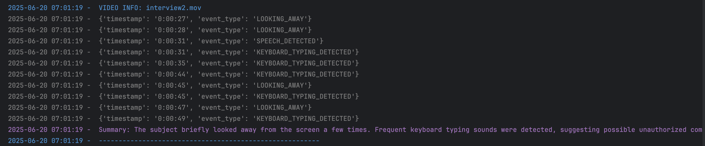

# ⛏️ Cheat Detection Tool

This is a lightweight, modular project designed for detecting 
suspicious behaviors during test or interview sessions using video and audio analysis.

Before starting this project, I decided to create my own 
'detection' module and also its submodules like 'detectors' and
'pipeline'. The reason is that large VLMs like `LLaVA` or `GPT-4o` are paid, and 
it is hard to run locally due to their size and resource requirements (e.g LLaVA).
In addition, the other models which are able to run locally like `BLIP/BLIP2`
didn't give me what I expect and also need for specific tasks.

As a result, I built a custom detection module that is lightweight, fast, modular, 
and easy to expand later.

The entire design, architecture, and implementation of the core detection module 
— including the detectors and pipeline submodules — 
along with all key code components, are my original work.

---

## 📂 Project Structure
```
.
├── main.py                    # Main script to run detection
├── README.md                  # Project documentation
├── results/                   # JSON reports of detections, created after detections
│   ├── interview1.json
│   ├── interview2.json
│   └── ...
├── assets/                     # Media folder
│   ├── videos/                 # Interview videos (.mov)
│   │   ├── interview1.mov
│   │   └── ...
│   └── audio/                  # Extracted audio files (.wav) If not exists, will be created
│       ├── interview1.wav
│       └── ...
├── detection/                  # Detection module
│   ├── detection.py            # Detection class used to initialize and run pipelines
│   ├── frame_parser.py         # Frame parser for videos 
│   ├── logging.py              # Custom logging class
│   ├── detectors/              # Detector (sub-module)
│   │   ├── face_detector.py.   
│   │   ├── object_detector.py
│   │   ├── audio_detector.py
│   │   └── base_detector.py
│   └── pipeline/               # Pipeline module to arrange video order, detections and reports.
│       ├── base_pipeline.py
│       └── cheating_pipeline.py
├── YAMNet_class_map.csv        # Audio label definitions (for speech/typing)
├── yolov8m.pt                  # YOLOv8 (medium) weights
└── yolov8n.pt                  # YOLOv8 (nano) weights

```
---

## 🛠️  Setup

To run this project, you need to install the required Python packages.

Install the dependencies using the following commands:

```bash
pip install opencv-python
pip install mediapipe
pip install moviepy
pip install tensorflow
pip install tensorflow-hub
pip install ultralytics
pip install soundfile

```

Additionally, make sure you have `ffmpeg` installed on your system. 

It is required by `moviepy` for audio and video processing.

### MacOS

```bash
  brew install ffmpeg
 ```

### Windows

Download the latest version from `https://ffmpeg.org/download.html` and add it to your system PATH.


---
## 🏗️ System Design & Class Architecture

### 📦 Module: Detection


### 🔹 Logging
 
Logging is one of the most important issue in software development process. 
It allows us to monitor and trace each step of execution. Thus, I have written custom 
logging class. Implemented also `Color` and `Level` enum classes.

```
import datetime
from enum import Enum

class Color(Enum):
    RED = "\033[31m"
    GREEN = "\033[32m"
    YELLOW = "\033[33m"
    BLUE = "\033[34m"
    MAGENTA = "\033[35m"
    CYAN = "\033[36m"
    WHITE = "\033[37m"

class Level(Enum):
    DEBUG = '[DEBUG]'
    INFO = '[INFO]'
    SUCCESS = '[SUCCESS]'
    WARN= '[WARN]'
    ERROR = '[ERROR]'

class DetectionLogger:

    def __init__(self):
        self.__reset = "\033[0m"

    def log(self,color:Color,msg:str):
        """ Displays log messages the given message with given color."""
        current_time = datetime.datetime.now().strftime("%Y-%m-%d %H:%M:%S")
        print(f"{color.value} {current_time} -  {msg} {self.__reset}")
```

### 🔹 FrameParser
 
Frame parser class is created to parse given videos. It holds the capture (`cv2.VideoCapture` instance).
Calculates fps value and creates empty frame list.

```
import cv2 as cv
import datetime
from detection.logging import DetectionLogger, Color, Level

class FrameParser:

    def __init__(self, capture:cv.VideoCapture):
        self.cap = capture
        self.fps = capture.get(cv.CAP_PROP_FPS)
        self.frames:list[dict] = []
        self.total_time = 0
        self.total_frame = 0

```

### FrameParser().parse()

According to the fps value taken from the capture, sets the time period as 1 second and starts to store
each frame which is `n'th second`. 

#### NOTE:
The stored data format (each element) is `{'timestamp': str,'frame':ndarray }`.
It is highly important to keep this information. This is because the detectors 
inherited from `VideoDetector` will be using this format.

```
    def parse(self) -> list:
        """
        Parses the given capture object (VideoCapture).
        The time period is arranged as 1 second.
        :return: The list of frames which contains 'timestamp' (str) and 'frame' (numpy.ndarray)
        """
        logger = DetectionLogger()
        success, frame = self.cap.read()
        count = 0

        while success:

            if count % int(self.fps) == 0:
                current_sec = count / int(self.fps)
                timestamp = str(datetime.timedelta(seconds=current_sec))

                data = {
                    "timestamp": timestamp,
                    "frame": frame,
                }
                self.frames.append(data)

            success, frame = self.cap.read()
            count += 1


        self.cap.release()
        self.total_frame = count
        self.total_time = self.total_frame / self.fps

        logger.log(Color.GREEN, f"{Level.SUCCESS.value} Frame Parsing Completed ")

        return self.frames

```

### 🔹 Detection

This is the core class. It creates a pipeline according to given type of `Pipeline`. 
The module has only the base pipeline and cheating detection pipeline for now. 
Then, it passes the provided parameters video list and folder path of the videos into the pipeline.
When it runs, it starts detection. You can disable saving and logging options which are activated as default.


```
from .pipeline import Pipeline

class Detection:

    def __init__(self, p: type[Pipeline],videos:list,video_folder_path:str):
        self.pipeline = p(videos,video_folder_path)

    def run(self,log_results:bool = True, save_results:bool = True) -> None:

        self.pipeline.start_detection()

        if log_results:
            self.pipeline.log_detection_results()

        if save_results:
            self.pipeline.save_results()

```

---

### 📦 Module: Detectors 

### 🔹 Flag 

`Flag` is an `Enum` class that defines all possible detection event types like `LOOKING_AWAY`.
 
```
 class Flag(Enum):

    LOOKING_AWAY = 'LOOKING_AWAY'
    MULTIPLE_PEOPLE = 'MULTIPLE_PEOPLE'
    NO_PEOPLE = 'NO_PEOPLE'
    EXTERNAL_DEVICE_DETECTED = 'EXTERNAL_DEVICE_DETECTED'
    KEYBOARD_TYPING_DETECTED = 'KEYBOARD_TYPING_DETECTED'
    SPEECH_DETECTED = 'SPEECH_DETECTED'
 ```

### 🔹 Detector 

`Detector` is the base detector class. All the detectors have their own result list to store 
and also logger which is an instance of `DetectionLogger`. 
The detect method is defined in the base class but not implemented.

```
class Detector:

    def __init__(self):
        self.results = []
        self.logger =  DetectionLogger()

    def detect(self):
        raise NotImplementedError()
 ```

### 🔹 VideoDetector

`VideoDetector` is a subclass of the `Detector` 
and also the parent of classes named `FaceDetector` and `ObjectDetector` which are related to visual frames.

```
class VideoDetector(Detector):

    def __init__(self, frames: list[dict]):
        """
        Initialize an VideoDetector.

        :param frames: List of dictionaries that keeps frame data. It is highly recommended to FrameParser's parse() method.
        This is because list of dictionaries must contain 'timestamp' (str) and 'frame' (numpy.ndarray).
        """
        super().__init__()
        self.frames = frames

    def detect(self):
        raise NotImplementedError()
```


### 🔹 FaceDetector

`FaceDetector` is a child of `VideoDetector`. The face detector is implemented to detect head and 
eye movements (gaze). In order to achieve this goal, I have used `mediapipe` framework to extract
landmarks from face.

```
class FaceDetector(VideoDetector):

    def __init__(self, frames: list[dict]):
        super().__init__(frames)
        self.mesh = mp.solutions.face_mesh.FaceMesh(static_image_mode=False,refine_landmarks=True)
```

### FaceDetector().detect()

The detect method is implemented in the `FaceDetector` for no-face detection, multiple-face detection,
gaze detection and head-turning detection.
In order to use this method easily, I have also created `Face` and `Eye` classes to control movements via landmarks.

```
    def detect(self):
        """
        Detects objects in provided frames.
        Provided frame data list should be parsed via FrameParser.
        It is highly recommended because the expected frame list must be the list of dictionaries which
        contains 'timestamp' (str) and 'frame' (numpy.ndarray).

        This detector detects objects via 'mediapipe'. It extracts the landmarks on the face and according to the
        movements of head and eyes (gaze) in order to detect.

        It checks whether gaze is in the center or whether head turns to left or right.

        - The results are stored in 'self.results'
        """
        for data in self.frames:
            rgb_format = cv.cvtColor(data['frame'],cv.COLOR_BGR2RGB)
            results = self.mesh.process(rgb_format)

            if not results.multi_face_landmarks:
                self.logger.log(Color.YELLOW, f"{Level.INFO.value} No people is detected on frame {data['timestamp']}.")
                self.results.append(
                    {
                        'timestamp': data['timestamp'],
                        'event_type': Flag.NO_PEOPLE.value
                    }
                )

            elif len(results.multi_face_landmarks) > 1:
                self.logger.log(Color.YELLOW, f"{Level.INFO.value} More than one people are detected on frame {data['timestamp']}.")
                self.results.append(
                    {
                        'timestamp': data['timestamp'],
                        'event_type':Flag.MULTIPLE_PEOPLE.value
                    }
                )

            else:
                face_landmark = results.multi_face_landmarks[0]
                #print(data.get('timestamp'))
                face = Face(face_landmark)

                if face.detect_gaze() is not None or face.detect_head_turn() is not None:
                    self.logger.log(Color.YELLOW, f"{Level.INFO.value} Person might be looking away on frame {data['timestamp']}.")
                    self.results.append(
                        {
                            'timestamp': data['timestamp'],
                            'event_type': Flag.LOOKING_AWAY.value
                        }
                    )

        self.mesh.close()

```

### 🔹 Face

Face class needs a `NormalizedLandmarkList` in order to extract the boundaries of eyes and the iris.
`detect_gaze()` and `detect_head_turn()` methods has been implemented to detect glance and head turning.

#### NOTE: 
The landmark values and some certain usages such as  `face_landmark.landmark[33].x"` are taken from external sources.
```

class Face:

    def __init__(self,face_landmark: landmark_pb2.NormalizedLandmarkList):
        """
        Face object keeping the landmarks which are extracted from a frame.
        :param face_landmark: Extracted normalized landmark list to get boundaries of eyes and the point of iris.
        """
        self.face_landmarks = face_landmark
        self.left_eye = Eye(face_landmark.landmark[33].x, face_landmark.landmark[133].x, face_landmark.landmark[468].x)
        self.right_eye = Eye(face_landmark.landmark[362].x, face_landmark.landmark[263].x, face_landmark.landmark[473].x)

    def detect_gaze(self) -> str | None:
        """
        :return: Returns 'LOOKING_AWAY' string if both the eyes are not in the center . Else returns None.
        """
        left_eye = self.left_eye.check_eye_direction()
        right_eye = self.right_eye.check_eye_direction()


        if left_eye == 0 or right_eye == 0:
            return None
        else:
            return 'LOOKING_AWAY'


    def detect_head_turn(self) -> str | None:
        """
        :return: Returns a string value ("HEAD_RIGHT" or  "HEAD_LEFT") if head is turned. Else returns None.
        """
        left_face = self.face_landmarks.landmark[234].x
        right_face = self.face_landmarks.landmark[454].x
        nose = self.face_landmarks.landmark[1].x

        face_center = (left_face + right_face) / 2
        deviation = nose - face_center

        if deviation > 0.03:
            return "HEAD_RIGHT"
        elif deviation < -0.03:
            return "HEAD_LEFT"
        else:
            return None
```


### 🔹 Eye

`Eye` class is implemented to be used within the `Face` class. After all, faces need eyes, right? 👀.
`Eye` class is need boundaries and iris which will be passed by the class `Face`.
In the method of `check_eye_direction()`, we check whether the eyes are in the center or not. 
We do this by calculating the mean of 2 boundaries and checking the iris relative to the mean.

#### NOTE: 
The landmark values and some certain usages such as  `face_landmark.landmark[33].x` are taken from external sources.
```

class Eye:

    def __init__(self,in_bound:float,out_bound:float,iris:float):
        """
        Eye object to represent the eye's position. It stores:
            - Inner eye boundary
            - Outer eye boundary
            - Iris

        :param in_bound: Position of the inner eye boundary (int).
        :param out_bound: Position of the outer eye boundary (int).
        :param iris: Position of the iris (int).
        """
        self.in_bound  = in_bound
        self.out_bound = out_bound
        self.iris = iris

        #print(f'round(self.in_bound, 3), round(self.iris, 3), round(self.out_bound, 3))

    def check_eye_direction(self) -> int:
        """
        :return: Returns '0' (int) if iris not in the center. Else returns '1' (int).
        """

        tolerance = 0.001

        #print(f'IRIS TOLARETED: {round(self.iris + tolerance,3)} BOUND MEAN: {round((self.out_bound + self.in_bound )/2,3)}')

        iris_tolareted = round(self.iris + tolerance,3)
        mean = round((self.out_bound + self.in_bound )/2,3)

        if iris_tolareted == mean:
            return 0
        else:
            if  iris_tolareted == mean + tolerance or iris_tolareted == mean - tolerance:
                return 0
            else:
                return 1
```


### 🔹 ObjectDetector

`ObjectDetector` is an also child of `VideoDetector`. The object detector is implemented to detect unauthorized 
devices such as cell phones, keyboards, books, laptop etc.
In this model I decided to use pre-trained `YOLO` models to detect the devices from the frames.
The target objects have been set in the class, which the models are already trained with them.

In order to be more effective, I use both `YOLO`s `yolov8m` and `yolov8n` models among the all 5 models.
According to my observations, especially in the interview5.mov, one of them detects the device 
while other one cannot. That's why to detect the devices in the more frames the both have been used.
```
from ultralytics import YOLO
from .base_detector import Flag, VideoDetector
from detection.logging import  Color, Level

class ObjectDetector(VideoDetector):

    def __init__(self, frames: list[dict]):
        super().__init__(frames)

        self.model_m = YOLO('../../yolov8m.pt')
        self.model_s = YOLO('../../yolov8n.pt')

        self.target_objects = {'cell phone', 'keyboard', 'book', 'laptop', 'pen', 'tablet'}
```

###  ObjectDetector().detect()

As mentioned above, in the `detect()` method of ObjectDetector, the frame data is passed to both models for processing.
Once for `yolov8m` and once for `yolov8n'`.

```
    def detect(self):
        """
        Detects objects in provided frames.
        Provided frame data list should be parsed via FrameParser.
        It is highly recommended because the expected frame list must be the list of dictionaries which
        contains 'timestamp' (str) and 'frame' (numpy.ndarray).

        This detector detects objects via YOLOv8m and YOLOv8n models. The both of them are used to catch object which
        other model may miss.

        - The results are stored in 'self.results'
        """

        for data in self.frames:
            frame = data['frame']

            results_n = self.model_s(frame,verbose=False)
            results_m = self.model_m(frame,verbose=False)

            # model: yolov8n
            for result in results_n:
                for box in result.boxes:
                    cls_id = int(box.cls[0])
                    label = self.model_s.names[cls_id]

                    if label in self.target_objects:
                        self.logger.log(Color.YELLOW, f"{Level.INFO.value} External device detected on frame {data['timestamp']}.")
                        self.results.append(
                            {
                                'timestamp':data['timestamp'],
                                'event_type': Flag.EXTERNAL_DEVICE_DETECTED.value
                            }
                        )

                        break

            # model: yolov8m
            for result in results_m:
                for box in result.boxes:
                    cls_id = int(box.cls[0])
                    label = self.model_m.names[cls_id]

                    if label in self.target_objects:
                        self.logger.log(Color.YELLOW, f"{Level.INFO.value} External device detected on frame {data['timestamp']}.")
                        self.results.append(
                            {
                                'timestamp': data['timestamp'],
                                'event_type': Flag.EXTERNAL_DEVICE_DETECTED.value
                            }
                        )

                        break

```

### 🔹 AudioDetector

`AudioDetector` is another subclass of the `Detector`
and also the parent of classes named `SpeechDetector` and `TypingDetector` which are related to audio data.

The parent class AudioDetector is responsible to create, store  and make the `YAMNet` pre-trained model ready, which is developed by 
`Google Research` and has 521 different classes. 

It initially extracts `audio_clip`. Then stores the audio file under the given `target_folder`.

If the file already exists in the provided folder, it gives you a warning that the file will be overwritten.

The frame_duration is set as 1.0, so it means the time-periods will be 1 second.

The `detect()` method not implemented. The necessary attributes such as model, frame duration will be used in the subclasses.

```
import urllib
from enum import Enum
import shutil
from moviepy.audio.io.AudioFileClip import AudioFileClip
import os
import tensorflow_hub as hub
import csv
from detection.logging import DetectionLogger, Color, Level

class AudioDetector(Detector):

        def __init__(self, video_path: str, target_file_name: str, target_folder:str = "audio"):
        """
        Initialize an AudioDetector.

        Extracts audio frames from a video file and stores the file in target folder name which is "audio" as a default.

        :param video_path: The exact video file path, e.g. "assets/video/example_video1.mov" or "assets/video/example_video1.mp4"
        :param target_file_name: The target audio file name, e.g. "example_audio1.wav"
        :param target_folder: The target audio folder name, e.g. "audio" or "assets/audio"
        """
        super().__init__()
        self.target_folder = target_folder
        self.audio_path = os.path.join(target_folder, target_file_name)

        audio_clip = AudioFileClip(video_path)

        if self.__file_exists():
            self.logger.log(Color.RED, f'{Level.WARN.value} The file {self.audio_path} already existed and was overwritten!')

        audio_clip.write_audiofile(self.audio_path, fps=16000, nbytes=2, codec='pcm_s16le')
        audio_clip.close()

        self.model = None
        self.labels = self.__make_model_ready()
        self.frame_duration = 1.0

        
    def detect(self):
        raise NotImplementedError()
```

### AudioDetector - file handling

Desired path can be created via provided parameters in the init method such as 
`target_file_name: str` and `target_folder:str = "audio" ` (as default).

```
    def __create_folder_if_missing(self):
        """
        Creates folder with a provided folder name if it doesn't exist.
        """

        if not os.path.exists(self.target_folder):
            os.makedirs(self.target_folder)
        else:
            if not os.path.isdir(self.target_folder):
                shutil.rmtree(self.target_folder)
                os.makedirs(self.target_folder)

    def __file_exists(self) -> bool:
        """
        Checks whether the file exists or not.
        """
        self.__create_folder_if_missing()

        if os.path.exists(self.audio_path):
            return True
        else:
            return False
```

### AudioDetector().__make_model_ready()

This method downloads the `YAMNet` model and loads its weights and also download labels and stores the labels which 
represent 521 classes with a file named `YAMNet_class_map.csv` under the root directory.

```
    def __make_model_ready(self) -> list:
        """
        Downloads and loads 'YAMNet' model via the public link.
        Fetches the labels for the model and stores them in 'YAMNet_class_map.csv' file
        that will be located in the root directory.

        :return: List of labels.
        """

        YAMNet_model = 'https://tfhub.dev/google/YAMNet/1'
        self.model = hub.load(YAMNet_model)

        labels_path = 'YAMNet_class_map.csv'
        urllib.request.urlretrieve(
            'https://raw.githubusercontent.com/tensorflow/models/master/research/audioset/YAMNet/YAMNet_class_map.csv',
            labels_path
        )

        with open(labels_path) as f:
            reader = csv.reader(f)
            next(reader)
            labels = [row[2] for row in reader]

        return labels
```

### 🔹 SpeechDetector

`SpeechDetector` is a subclass of `AudioDetector`. It initially creates its own checklist
for its own purpose, in order to filter the output of the model. 

In addition, It has another attribute named threshold, 
which also helps to filter scores. If output is filtered according to the checklist
but the scores are not in range of threshold, doesn't store those detected sounds.


```
import datetime
import math
import numpy as np
import soundfile as sf
from .base_detector import  AudioDetector, Flag
from detection.logging import  Color, Level

class SpeechDetector(AudioDetector):

    def __init__(self, video_path:str, target_file_name:str,target_folder:str = "audio"):
        super().__init__(video_path, target_file_name,target_folder)
        self.check_list = [
            "Whispering",
            "Conversation",
            "Narration, monologue",
            "Talk",
            "Voice"
        ]
        self.threshold = 1e-04
```


### 🔹 TypingDetector

`TypingDetector` is another subclass of `AudioDetector` such as `SpeechDetector`. 
Just like `SpeechDetector`, it initially creates its own checklist
for its own purpose, in order to filter the output of the model. 

In addition, just like `SpeechDetector`, it has another attribute named threshold, 
which also helps to filter scores. If output is filtered according to the checklist
but the scores are not in range of threshold, doesn't store those detected sounds.

```
class TypingDetector(AudioDetector):

    def __init__(self, video_path:str, target_file_name:str,target_folder:str = "audio"):
        super().__init__(video_path, target_file_name,target_folder)
        self.check_list = [
            "Keyboard typing",
            "Keypad tones",
            "Text message",
            "Typing",
            "Computer keyboard"
        ]
        self.threshold = 1e-08
```

#### Note:
Because of using the same model (comes from the parent class `AudioDetector`), 
the implementations of the `detect()` methods are nearly the same.


### SpeechDetector().detect() &  TypingDetector().detect()

Because of using same model, like init methods, most of the implementations are the same. 
However, there is a very small part that is different between them.

The `check_lists` and `thresholds` are different.
Therefore, the final part of the implementation 
— which stores the results — 
uses different event_type attributes.

For `SpeechDetector` it is `Flag.SPEECH_DETECTED.value`
and for `TypingDetector` it is `Flag.KEYBOARD_TYPING_DETECTED.value`


#### Common:
```
 def detect(self):
        """
        Detects objects in provided frames.
        Provided frame data list should be parsed via FrameParser.
        It is highly recommended because the expected frame list must be the list of dictionaries which
        contains 'timestamp' (str) and 'frame' (numpy.ndarray).

        This detector detects objects via 'YAMNet' model. According to the check_list which is already defined in the class,
        filters the output of the model and catches the audio frames whose scores are within accepted threshold range.

        - The results are stored in 'self.results'
        """

        waveform, sr = sf.read(self.audio_path, dtype='float32')

        frame_length = int(sr * self.frame_duration)
        total_length = len(waveform)
        num_frames = math.ceil(total_length / frame_length)

        if len(waveform.shape) > 1 and waveform.shape[1] == 2:
            waveform = np.mean(waveform, axis=1)

        if sr != 16000:
            raise ValueError('YAMNet requires 16 kHz audio.')

        for i in range(num_frames):
            start = i * frame_length
            end = start + frame_length
            frame = waveform[start:end]

            if len(frame) < frame_length:
                padding = np.zeros(frame_length - len(frame))
                frame = np.concatenate((frame, padding))

            scores, embeddings, spectrogram = self.model(frame)
            scores_np = scores.numpy()
            mean_scores = np.mean(scores_np, axis=0)
            output = np.argsort(mean_scores)[::-1]
            top_labels = [(self.labels[i], mean_scores[i]) for i in output if
                          self.labels[i] in self.check_list and mean_scores[i] > self.threshold]

            check = False if len(top_labels) == 0 else True
            timestamp = str(datetime.timedelta(seconds=i * self.frame_duration))
```

#### Different - the end of the detect() method:
```
            if check:
                self.logger.log(Color.YELLOW, f"{Level.INFO.value} Typing (possible cheating) is detected on frame {timestamp}.")
                self.results.append({
                    "timestamp": timestamp,
                    "event_type": Flag.KEYBOARD_TYPING_DETECTED.value
                })
```

#### NOTE : 
The following lines in these detect methods, including the usage of the YAMNet model and preprocessing steps such as
```
        waveform, sr = sf.read(self.audio_path, dtype='float32')
  
         if len(waveform.shape) > 1 and waveform.shape[1] == 2:
            waveform = np.mean(waveform, axis=1)
  
         for i in range(num_frames):
            start = i * frame_length
            end = start + frame_length
            frame = waveform[start:end]
  
              if len(frame) < frame_length:
                padding = np.zeros(frame_length - len(frame))
                frame = np.concatenate((frame, padding))

            scores, embeddings, spectrogram = self.model(frame)
            scores_np = scores.numpy()
            mean_scores = np.mean(scores_np, axis=0)
            output = np.argsort(mean_scores)[::-1]
```
were adapted from external sources (e.g., official examples or open-source implementations).


---

### 📦 Module: Pipeline 

### 🔹 Pipeline 

The `Pipeline` class is the base class which is used by the `Detection` class. 
It is responsible for building a processing pipeline,
managing a list of videos, iterating over them, storing detection results,
and saving these results to a folder in a specified format.

```
    def __init__(self, videos: list, video_folder_path: str):
        """
        Initialize a pipeline.
        :param videos: List of video names with their extension to be included in the pipeline. e.g ["video1.mov", "video2.mov",...]
        :param video_folder_path: The path of the folder where the videos are located and be used during the pipeline.
        """
        self.video_folder_path = video_folder_path
        self.video_list = videos
        self.current_index = 0
        self.current_video = self.video_list[self.current_index]
        self.current_path = os.path.join(video_folder_path, self.current_video)
        self.detection_results = []

        self.logger = DetectionLogger()
        self.current_detector: Detector = None

```

### Pipeline().get_frame_data()

Returns the frame data with `{'timestamp':str, 'frame':ndarray}` format. It uses `FrameParser`.

```
 def get_frame_data(self) -> list[dict]:
        """
        Retrieves all frame data from the video as a list of dictionaries.

        The dictionary contains:

        - "timestamp" (str): The timestamp of the frame in the format 'HH:MM:SS',
          calculated based on the frame number and the video's FPS.

        - "frame" (numpy.ndarray): The actual video frame image (BGR format) as
          read by OpenCV.

        :return: List of dictionaries which are the frame data.
        """
        cap = cv.VideoCapture(self.current_path)
        parser = FrameParser(cap)
        frame_data = parser.parse()
        return frame_data
```

### Pipeline().get_frames()

Returns a list of frames containing only `np.ndarray` objects.

#### Note:
This method is implemented for future use and is not currently utilized in the project.
```
    def get_frames(self) -> list:
        """
        Retrieves the actual frame list from the frame data.
        :return: Frame list.
        """
        frames = [data['frame'] for data in self.get_frame_data()]
        return frames
```

### Pipeline().next_video()

Updates the `current_index`, `current_video` (`str object`) and the `current_path`.

```
    def next_video(self):
        """
        Updates the current index number and the current video.
        If the index is out of range, the index will be 0 again and also the video will be the first one.
        """
        self.current_index += 1
        if self.current_index >= len(self.video_list):
            self.current_index = 0
        self.current_video = self.video_list[self.current_index]
        self.current_path = os.path.join(self.video_folder_path, self.current_video)
```

### start_detection() & log_detection_results() & save_results() 

These methods are not implemented in the base class and are intended to be implemented in subclasses.

```
    def start_detection(self):
        """
        Starts detection pipeline on the provided video list.
        """
        raise NotImplementedError()


    def log_detection_results(self):
        """
        Displays the results of the detection process.
        """
        raise NotImplementedError()

    def save_results(self,folder_path:str = 'results'):
        """
        Saves the detection results.
        """
        raise NotImplementedError()
```


### 🔹 CheatDetectionPipeline 

This is a subclass of `Pipeline`, and currently the only pipeline implemented.
First of all, it defines its own detection results using a custom format.

```
    def __init__(self, videos: list, video_folder_path: str):
        super().__init__(videos, video_folder_path)
        self.detection_results = [{'video': video, 'events': []} for video in self.video_list]
```

### CheatDetectionPipeline().detect()

The `CheatDetectionPipeline` runs a comprehensive 4-layered detection process on a provided list of videos. The layers are:
##### 1. Face detection
##### 2. Object detection
##### 3. Speech detection
##### 4. Typing detection

The detection process runs a while loop that goes through each video in the video list. For each video, 
it uses the four detectors one by one and collects their results.

Process details for each video:

#### Face Detection:
Detects eye and head movements using `FaceDetector`.

#### Object Detection:
Identifies unauthorized objects within the frames via `ObjectDetector`.

#### Speech Detection: 
Processes audio extracted from the current video to detect speech events with `SpeechDetector`.

#### Typing Detection: 
Processes audio extracted from the current video to detect typing sounds with `SpeechDetector`.

After all detectors finish checking the video, all found events are joined together and put in order by `timestamp`.
Then, a summary of the results is made and added before going to the next video.

Each pipeline might have its own implementation.

```
    def start_detection(self):
        """
        Starts detection pipeline on the provided video list.
        Detection process is a 4-layered process which are:
            1. face detection
            2. object detection
            3. speech detection and
            4. keyboard-typing detection.
        """
        count = 0

        while True:

            if count >= len(self.video_list):
                break

            self.logger.log(Color.MAGENTA, f" The Current Video is {self.current_video} ")
            self.logger.log(Color.MAGENTA,
                            f"--------------------------------------------------------------------------")

            frame_data = self.get_frame_data()

            # Face Detection -------------------------------------------------------------------------------------------
            self.logger.log(Color.CYAN,
                            f'{Level.INFO.value} Starting detection pipeline.. \n The 1st Layer : Face Detection')

            self.current_detector = FaceDetector(frame_data)
            self.current_detector.detect()
            self.detection_results[self.current_index]['events'].extend(self.current_detector.results)

            # Object Detection -----------------------------------------------------------------------------------------
            self.logger.log(Color.CYAN, f'{Level.INFO.value} The 2nd Layer: Object Detection')

            self.current_detector = ObjectDetector(frame_data)
            self.current_detector.detect()
            self.detection_results[self.current_index]['events'].extend(self.current_detector.results)

            # Speech Detection -----------------------------------------------------------------------------------------
            self.logger.log(Color.CYAN, f'{Level.INFO.value} The 3rd Layer: Speech Detection')

            self.current_detector = SpeechDetector(self.current_path,
                                                   self.current_video.split('.')[0] + '.wav',
                                                   'assets/audio')
            self.current_detector.detect()
            self.detection_results[self.current_index]['events'].extend(self.current_detector.results)

            # Typing Detection -----------------------------------------------------------------------------------------
            self.logger.log(Color.CYAN, f'{Level.INFO.value} The 4th Layer: Typing Detection')

            self.current_detector = TypingDetector(self.current_path,
                                                   self.current_video.split('.')[0] + '.wav',
                                                   'assets/audio')
            self.current_detector.detect()
            self.detection_results[self.current_index]['events'].extend(self.current_detector.results)
            # -----------------------------------------------------------------------------------------------------------

            # Sorting events by timestamp
            self.detection_results[self.current_index]['events'].sort(key=lambda r: datetime.datetime.strptime(r['timestamp'], '%H:%M:%S'))

            self.__add_summary(self.detection_results[self.current_index]['events'])

            count += 1
            self.next_video()
```


### CheatDetectionPipeline().log_detection_results()

This method shows the detection results.

It goes through each video and prints the video information and the summary. Then, it shows all events found in that video.

Each pipeline might have its own implementation.

```
    def log_detection_results(self):

        print('\n')
        self.logger.log(Color.BLUE, f' -------------- RESULTS -------------- ')
        for result in self.detection_results:
            self.logger.log(Color.BLUE, f'VIDEO INFO: {result["video"]}')
            for r in result['events']:
                self.logger.log(Color.WHITE, r)
            self.logger.log(Color.MAGENTA, f'Summary: {result["summary"]}')
            self.logger.log(Color.BLUE, '--------------------------------------------------------')
```

### CheatDetectionPipeline().save_results()

Saves the detection results into files.

It creates a folder with the given `folder_path` which is `results` as a default
if it does not already exist. Then, for each video, it saves the results in a `JSON` file named after the video.

Each pipeline might have its own implementation.

```
    def save_results(self,folder_path:str = 'results'):

        os.makedirs(folder_path, exist_ok=True)

        for result in self.detection_results:
            file_name = result['video'].split('.')[0] + '.json'

            file_path = os.path.join(folder_path, file_name)

            with open(file_path, "w", encoding="utf-8") as f:
                json.dump(result, f, indent=4, ensure_ascii=False)
```

### CheatDetectionPipeline().__add_summary()

This method creates a summary report for each video and the summary is saved with the detection results.

This method is designed for a particular task and is implemented only in this pipeline.

```
    def __add_summary(self, events: list[dict]):
        """
        Adds the summary of the detection results for each video.
        :param events: The list of dictionaries which contain 'timestamp' and 'event_type'.
        """

        summary = []

        if sum(e['event_type'] == Flag.LOOKING_AWAY.value for e in events) >= 5:
            summary.append("There were several moments when the subject looked away from the screen.")
        elif sum(e['event_type'] == Flag.LOOKING_AWAY.value for e in events) > 0:
            summary.append("The subject briefly looked away from the screen a few times.")

        if sum(e['event_type'] == Flag.MULTIPLE_PEOPLE.value for e in events) >= 2:
            summary.append("Multiple individuals were detected in the frame on several occasions.")
        elif sum(e['event_type'] == Flag.MULTIPLE_PEOPLE.value for e in events) == 1:
            summary.append("Another person appeared in the frame at one point.")

        if sum(e['event_type'] == Flag.NO_PEOPLE.value for e in events) >= 5:
            summary.append("The subject was missing from the camera view for an extended period.")
        elif sum(e['event_type'] == Flag.NO_PEOPLE.value for e in events) > 0:
            summary.append("The subject was temporarily not visible in the video.")

        if sum(e['event_type'] == Flag.EXTERNAL_DEVICE_DETECTED.value for e in events) >= 2:
            summary.append("An unauthorized device was visible in the video multiple times.")
        elif sum(e['event_type'] == Flag.EXTERNAL_DEVICE_DETECTED.value for e in events) == 1:
            summary.append("An external device was detected at one point during the session.")

        if sum(e['event_type'] == Flag.KEYBOARD_TYPING_DETECTED.value for e in events) >= 5:
            summary.append(
                "Frequent keyboard typing sounds were detected, suggesting possible unauthorized computer use.")
        elif sum(e['event_type'] == Flag.KEYBOARD_TYPING_DETECTED.value for e in events) > 0:
            summary.append("Some keyboard typing sounds were detected during the session.")

        if sum(e['event_type'] == Flag.SPEECH_DETECTED.value for e in events) >= 5:
            summary.append("Extended periods of speech were detected, possibly indicating conversation.")
        elif sum(e['event_type'] == Flag.SPEECH_DETECTED.value for e in events) > 0:
            summary.append("Occasional speech was detected, which may indicate communication.")

        if not summary:
            summary.append(
                "No suspicious activity was detected during the session. "
                "The subject appeared to remain attentive and compliant throughout the video.")

        self.detection_results[self.current_index]['summary'] = " ".join(summary)

```

---

## 📝 Results

| Results                                       |
|-----------------------------------------------|
|  |
|  |
|  |
|  |
|  |

---

## 📝 Logging

| Log - Outputs                                 |
|-----------------------------------------------|
|  |
|  |
|  |
|  |
|  |
